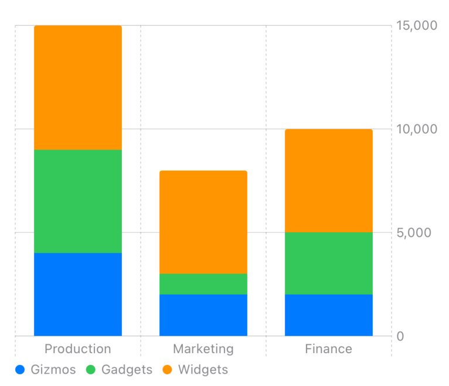

# Charts for LiveView Native SwiftUI

`liveview-native-swiftui-charts` is an add-on library for [LiveView Native](https://github.com/liveview-native/live_view_native). It adds [Swift Charts](https://developer.apple.com/documentation/charts) support for data visualization.

## Installation

1. In Xcode, select *File → Add Packages...*
2. Enter the package URL `https://github.com/liveview-native/liveview-native-swiftui-charts`
3. Select *Add Package*

## Usage

Import `LiveViewNativeCharts` and add `.charts` to the list of addons on your `LiveView`:

```swift
import SwiftUI
import LiveViewNative
import LiveViewNativeCharts

struct ContentView: View {
    var body: some View {
        #LiveView(
            .localhost,
            addons: [.charts]
        )
    }
}
```

Now you can use the `Chart` element in your template.

<table>

<tr>
<td>

```heex
<Chart>
  <BarMark
    :for={item <- @data}

    x:label="Department"
    x:value={item.department}

    y:label="Profit"
    y:value={item.profit}

    class="fg-product-category"
    product-category={item.product_category}
  />
</Chart>
```
```ex
~SHEET"""
"fg-product-category" do
  foregroundStyle(by: .value("Product Category", attr("product-category")))
end
"""
```

</td>

<td>

</td>

</tr>

</table>

## Learn more

You can view documentation on the elements and attributes in this addon from Xcode:

1. In Xcode, select *Product → Build Documentation* in the menu bar
2. Select *Window → Developer Documentation* (Xcode should open this for you after the documentation is built)
3. Select *LiveViewNativeCharts* in the sidebar
